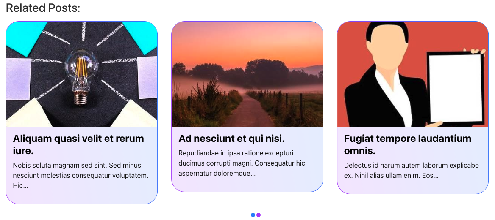

# Related Posts WordPress plugin

It shows random related posts of the current post. It lists 5 related post by default based on current post's categories. You can change the max page numbers from 1 to 20.
In Related Post list it'll show:

-   Thumbnail of the post if any.
-   Categoies of the related post( available only in List view ).
-   The title of the related post.
-   12 words of excerpts.
-   The whole list will be linked to the related post so that you don't have to find the linked text or image.

The list will show every single post page. In this initial realease it only support "post" post type.

### List View

### Carousel View

## Plugin Options

-   You can choose max 1 to 20 related posts for the list/carousel.
-   There are two styles
    1.  List View
    2.  Carousel View

## How to install

-   Go to WordPress Dashboard.
-   From the side panel selec Plugins.
-   Click on "Add New Plugin".
-   Again click on "Upload Plugin".
-   Please choose this plugin zip file "related-posts.zip" then press "Install Now" button.
-   You can Activate the plugin now.
-   You'll find the Setting link after activation
-   It's time to enjoy this new feature of your awesome site

## License

This software is licensed under the [MIT license](http://opensource.org/licenses/mit-license).

## Changelog

### Version 1.0.0 [ Aug 22, 2024 ]

-   Initial Realease

### Version 1.0.0 [ Sep 01, 2024 ]

-   Code Improvements
